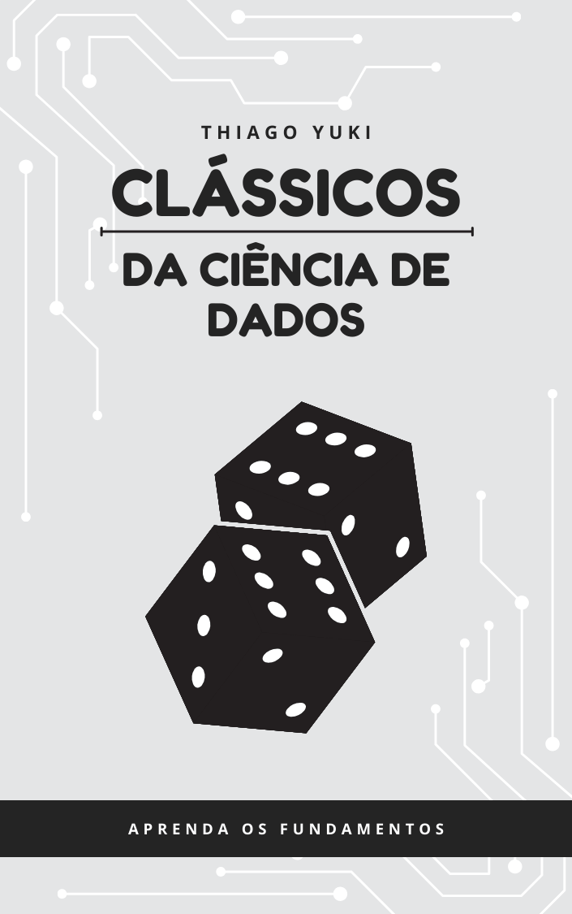

# Bem Vindo(a)

Ciência de dados continua sendo uma das áreas mais quentes no mercado de trabalho atualmente. Com a crescente quantidade de dados gerados diariamente, a capacidade de analisar, interpretar e extrair insights valiosos desses dados tornou-se essencial para empresas e organizações em diversos setores. 

{width=250px style="float: right; margin-left: 20px; margin-bottom: 10px;"}

Muitos profissionais estão migrando para a área de ciência de dados em busca de melhores oportunidades de carreira, salários mais altos e a chance de trabalhar em projetos inovadores. No entanto, essa transição pode ser desafiadora, especialmente para aqueles que não possuem um background técnico sólido.

Eu faço parte desse grupo de profissionais que decidiu embarcar na jornada da ciência de dados. Com formação em Química, percebi que, para avançar na minha carreira, era necessário adquirir habilidades em análise de dados, estatística e programação.

Sou testemunha de que, com dedicação e os recursos certos, é possível fazer essa transição com sucesso.  Neste livro, compartilho minha experiência e os conhecimentos que adquiri ao longo do caminho, com o objetivo de ajudar outros profissionais a alcançar seus objetivos na área de ciência de dados.

Dediquei 13 anos da minha vida profissional a pesquisa e desenvolvimento na indústria química, em especial o setor de papel e celulose. Quando decidi migrar para a área de ciência de dados, enfrentei diversos desafios, desde aprender novas linguagens de programação até entender conceitos estatísticos complexos. No entanto, com persistência e o uso de recursos adequados, consegui superar esses obstáculos e me tornar um cientista de dados competente.

Este livro é fruto da minha experiência pessoal e aprendizado ao longo dessa jornada. Nele, compartilho conhecimentos, dicas e recursos que me ajudaram a superar os desafios e a me tornar um cientista de dados competente. Espero que este material possa ser útil para outros profissionais que, assim como eu, estão buscando ingressar na área de ciência de dados e alcançar seus objetivos profissionais.

## Conteúdo do Livro 

Este livro esta dividido em 4 seções principais:

- **Descritivo:** Foca em técnicas de análise exploratória de dados e visualização para entender melhor os conjuntos de dados.
- **Preditivo:** Aborda técnicas e algoritmos de machine learning para construir modelos preditivos eficazes.
- **Prescritivo:** Explora métodos de otimização e tomada de decisão para recomendar ações com base em dados.
- **Diagnostico:** Que visa identificar causas raiz e entender o porquê dos eventos ocorrerem.

Dentro das seções estão organizados os casos de uso, que são exemplos práticos de aplicação das técnicas discutidas. Cada caso de uso inclui uma descrição do problema, a abordagem adotada, o código utilizado e os resultados obtidos.

Espero que este livro seja um recurso valioso para sua jornada na ciência de dados. Boa leitura e sucesso em sua carreira!

## Sobre o Autor

{width=350px style="float: right; margin-left: 20px; margin-bottom: 10px;"}

Meu nome é Thiago Yuki sou Cientista de Dados e apaixonado por transformar dados em insights valiosos. Com uma formação sólida em Química e mais de uma década de experiência na indústria química, decidi migrar para a área de ciência de dados para explorar novas oportunidades e desafios.

Hoje trabalho como Cientista de Dados, aplicando técnicas avançadas de análise de dados, machine learning e visualização para resolver problemas complexos e impulsionar a tomada de decisões informadas. 

Quer saber mais sobre minha trajetória e projetos? Visite meu site pessoal em [ResolvedorTech](https://resolvedortech.com.br) ou conecte-se comigo no [Linkedin](https://www.linkedin.com/in/thiagoyuki). Estou sempre aberto a novas conexões e oportunidades de colaboração na área de ciência de dados!

Também tenho um canal no YouTube onde compartilho conteúdos relacionados a ciência de dados, programação e tecnologia. Sinta-se à vontade para se inscrever e acompanhar meus vídeos em [ResolvedorTech](https://www.youtube.com/@resolvedortech).